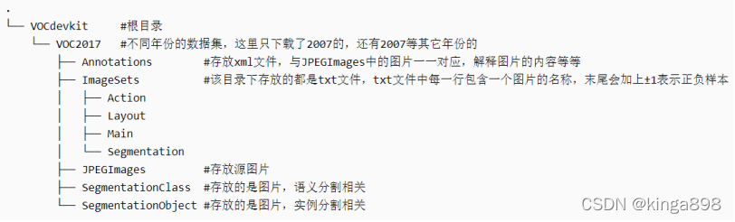
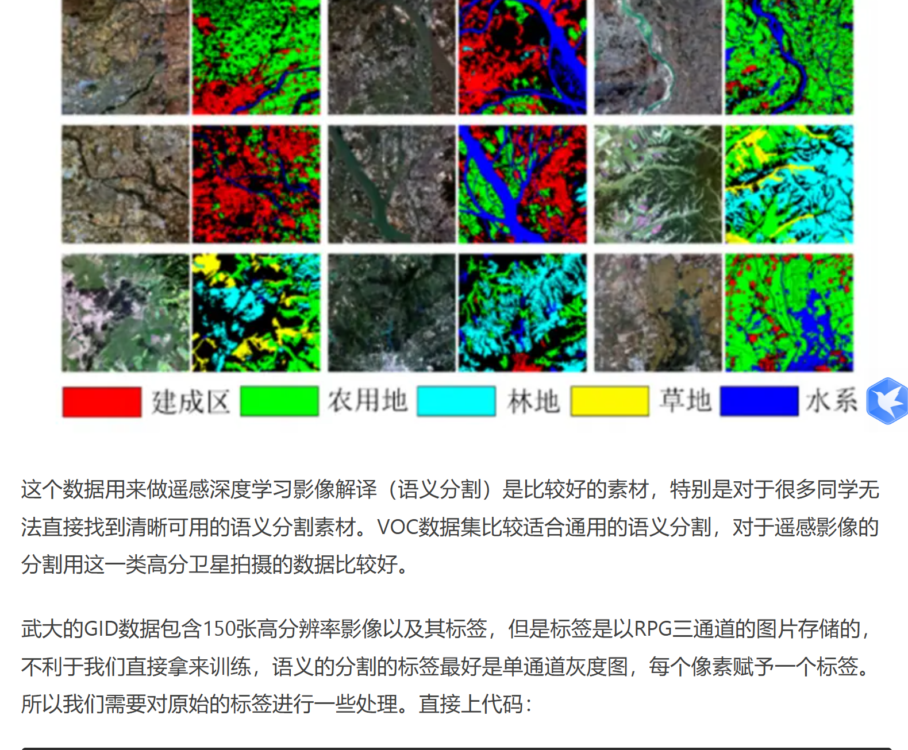
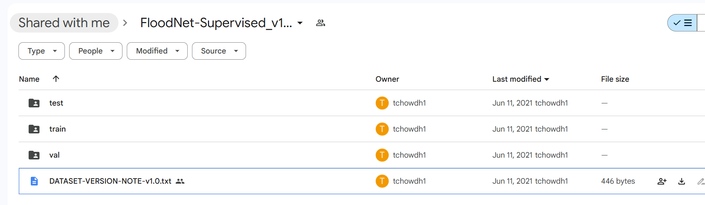
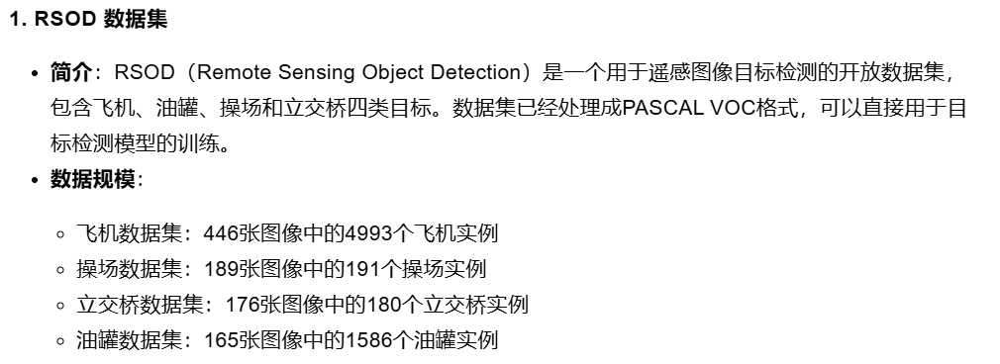

# PASCAL VOC 
1、 由PASCAL（pattern analysis，statistical modeling and computational learning）网络组织发起
2、 visual object classes视觉对象类别

## 最常用数据集版本 VOC2007、VOC2012
## VOC 格式
### annotation


```filename：图片文件名，例如 000001.jpg。

path：图片的绝对路径。

size：图像的尺寸，包括宽度 (width)、高度 (height) 和深度 (depth)。

object：图像中的目标物体信息：

name：目标的类别名称（如 cat）。

bndbox：目标的边界框（bounding box），包括左上角 (xmin, ymin) 和右下角 (xmax, ymax) 坐标。

VOC 格式的一个关键点是每个目标都会有一个对应的 <object> 标签，包含了该目标的类别和边界框。
```


# 遥感图像数据集

## [数据集]26个语义分割类遥感影像数据集推荐
https://zhuanlan.zhihu.com/p/532783880

## LOVEwd
武大修改

https://www.jianshu.com/p/c06d05cd06d5

## FloodNet-Supervised_v1.0
https://drive.google.com/drive/folders/1leN9eWVQcvWDVYwNb2GCo5ML_wBEycWD

```
VERSION NO. = FloodNet-Supervised_v1.0
##----------------------------------------------
Features: 
	1. Dataset is distributed same as FloodNet challenge.
	2. Masks are same size as original images.
	3. Total class: 10 ('Background':0, 'Building-flooded':1, 'Building-non-flooded':2, 'Road-flooded':3, 'Road-non-flooded':4, 'Water':5, 'Tree':6, 'Vehicle':7, 'Pool':8, 'Grass':9).
	4. Total image: 2343 (Train: 1445, Val: 450, Test: 448)
```
## RSOD


## iSAID航空图像大规模数据集

现有的 Earth Vision 数据集要么适用于语义分割，要么适用于对象检测。

iSAID 是第一个用于航空图像实例分割的基准数据集。

这个大规模和密集注释的数据集包含 2,806 张高分辨率图像的 15 个类别的 655,451 个对象实例。

iSAID 的显着特征如下：
(a) 大量具有高空间分辨率的图像，
(b) 十五个重要且常见的类别，
(c) 每个类别的大量实例，
(d) 每个类别的大量标记实例图像，这可能有助于学习上下文信息，
(e) 巨大的对象尺度变化，通常在同一图像内包含小、中和大对象，
(f) 图像内具有不同方向的对象的不平衡和不均匀分布，描绘真实-生活空中条件，
（g）几个小尺寸物体，外观模糊，只能通过上下文推理来解决，
（h）由专业注释者执行的精确实例级注释，由符合良好规范的专家注释者交叉检查和验证定义的指导方针。
