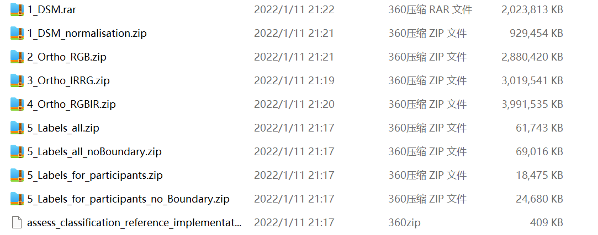

# potsdam

read://https_www.isprs.org/?url=https%3A%2F%2Fwww.isprs.org%2Feducation%2Fbenchmarks%2FUrbanSemLab%2F2d-sem-label-potsdam.aspx

## 划分
### Potsdam数据集分割方式：
所用的ZIP文件：
2_Ortho_RGB.zip
5_Labels_all.zip
5_Labels_for_all_no_Boundary.zip
数据分配：
train_images：从2_Ortho_RGB.zip中选择对应训练集（train + val）ID的文件。
test_images：从2_Ortho_RGB.zip中选择对应测试集ID的文件。
train_masks：从5_Labels_all.zip中选择对应训练集（train + val）ID的文件。
test_masks：从5_Labels_all.zip中选择对应测试集ID的文件。
test_masks_eroded：从5_Labels_for_all_no_Boundary.zip中选择对应测试集ID的文件。
数据切割： 使用potsdam_patch_split.py脚本进行数据切割。
### 数据集结构
│   ├── vaihingen
│   │   ├── train_images (original)
│   │   ├── train_masks (original)
│   │   ├── test_images (original)
│   │   ├── test_masks (original)
│   │   ├── test_masks_eroded (original)
│   │   ├── train (processed)
│   │   ├── test (processed)
│   ├── potsdam (the same with vaihingen)

### Potsdam数据集参数
图像瓦片数量：38个
图像大小：6000×6000像素
地面采样距离（GSD）：5厘米
多光谱波段：4个波段（红、绿、蓝、近红外）
额外数据：数字表面模型（DSM）和归一化数字表面模型（NDSM）
类别信息：与Vaihingen数据集相同
实验设置：
测试集：14个瓦片（2_13, 2_14, 3_13, 3_14, 4_13, 4_14, 4_15, 5_13, 5_14, 5_15, 6_13, 6_14, 6_15, 7_13）
验证集：1个瓦片（2_10）
训练集：22个瓦片（排除标注有误的7_10）
图像裁剪：裁剪成1024×1024像素的小块
使用的波段：红、绿、蓝

## DSM/digital surface model数字表面模型
三维的表示地球表面高度的数字化地图
### = TFW + TIFF
tfw 文件为对应的数字表面模型（DSM）图像 
tif 提供地理定位信息

```
这段文字是对Potsdam 2D语义标注竞赛数据集的详细描述。以下是对主要内容的解释：
数据集描述
数据集包含38个图像块：每个图像块大小相同，包含从更大的正射影像（TOP）镶嵌图中提取的真正射影像（TOP）和对应的数字表面模型（DSM）。
图像块的轮廓：如图所示，图像块的轮廓在正射影像镶嵌图上进行了标注，每个图像块都有编号，编号也包含在文件名中。
数据采集和处理
采样距离：正射影像（TOP）和数字表面模型（DSM）的地面采样距离（GSD）均为5厘米。
DSM生成：DSM是通过Trimble INPHO 5.6软件的密集图像匹配生成的。
正射影像镶嵌图生成：Trimble INPHO OrthoVista用于生成正射影像镶嵌图。
避免数据空白区域：为了避免正射影像和DSM中的数据空白区域（“孔洞”），图像块是从正射影像镶嵌图的中心部分选取的，而不是边界部分。正射影像和DSM中剩余的（非常小的）孔洞进行了插值处理。
数据格式和组成
正射影像（TOP）：以TIFF文件格式提供，具有不同的通道组合，每个通道的光谱分辨率为8位：
IRRG：3个通道（红外-红-绿）
RGB：3个通道（红-绿-蓝）
RGBIR：4个通道（红-绿-蓝-红外）
这样参与者可以根据需要方便地选择所需的数据。
数字表面模型（DSM）：DSM是单波段的TIFF文件；灰度级（对应于DSM高度）被编码为32位浮点值。正射影像和DSM定义在同一网格上（UTM WGS84）。每个瓦片都附带一个仿射变换文件（TIFF世界文件），以便在需要时重新组合图像到更大的镶嵌图中。
归一化DSM
归一化DSM：除了DSM，还提供了所谓的归一化DSM。归一化DSM是指在地面过滤后，每个像素的地面高度被移除，从而得到高于地形的高度表示。这些数据是通过完全自动的过滤工作流程生成的，没有手动质量控制。因此，这里不保证数据无错误，这只是为了帮助研究人员使用高度数据，而不是绝对的DSM。在下载文件夹中可以找到相应的zip文件。解压后会找到一个readme.txt文件，使用数据前应该阅读该文件。基于lastools的脚本也包含在内，因此参与者可能想要调整它们。然而，我们不提供支持。
示例和标注
示例图像块：提供了语义对象分类竞赛的示例图像块，包括（a）真正的正射影像，（b）DSM，以及（c）真实标注。
标注的真实数据：只有一部分数据提供了标注的真实数据。其余场景的真实数据将保持未发布，并由基准测试组织者保留，用于评估提交的结果。参与者应使用所有带有真实数据的数据进行训练（见表）或内部评估他们的方法。
数据块概览
数据块文件名：带有.tif扩展名的正射影像RGBIR：具有四个通道（红、绿、蓝、红外）的真实正射影像；正射影像IRRG：具有三个通道（红外、红、绿）的真实正射影像；正射影像RGB：具有三个通道（红、绿、蓝）的真实正射影像；DSM：数字表面模型；GT：真实标注（如果未提供给参与者，则为空，由基准测试组织者用于评估结果）。注意，相邻图像块之间没有间隙，以便模型具有上下文，更好地计算归一化DSM等。第一个数字始终表示行（从上到下，即从北到南），第二个数字表示列（从左到右，即从西到东）。例如，5_12的直接邻居是4_12（上方）、6_12（下方）、5_11（左侧）和5_13（右侧）。所有图像都附带相应的.tfw文件，提供UTM WGS84坐标系中的地理参考。
致谢
感谢BSF Swissphoto：感谢BSF Swissphoto免费提供数据。
希望这些解释能帮助你更好地理解Potsdam 2D语义标注竞赛数据集的内容和结构。
```