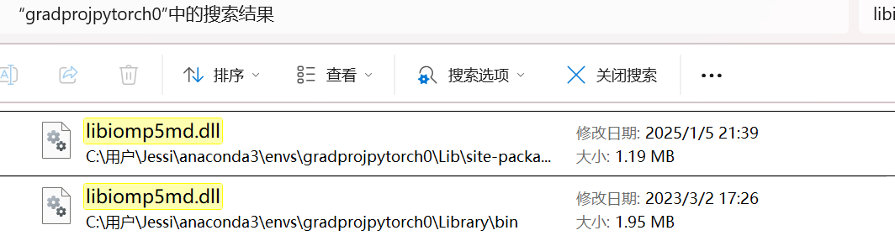
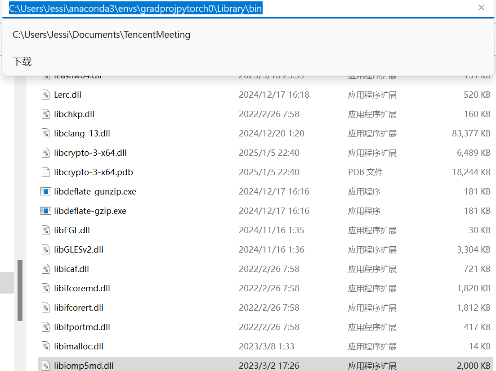
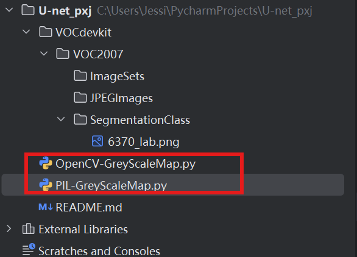

# ？OMP: Error #15: Initializing libiomp5md.dll, but found libiomp5md.dll already initialized


## （有效）solution：删除了


# ？为什么没效果（背景的像素点值为0，目标的像素点值为255）
标签为png图片，无需固定大小，传入训练前会自动进行resize。
   由于许多同学的数据集是网络上下载的，标签格式并不符合，需要再度处理。一定要注意！标签的每个像素点的值就是这个像素点所属的种类。
   网上常见的数据集总共对输入图片分两类，背景的像素点值为0，目标的像素点值为255。这样的数据集可以正常运行但是预测是没有效果的！
   需要改成，背景的像素点值为0，目标的像素点值为1。
   如果格式有误，参考：https://github.com/bubbliiiing/segmentation-format-fix
```
模型训练问题：
许多深度学习模型（如卷积神经网络）在训练时，期望标签值是连续的整数。使用0和255作为标签值可能会导致模型在训练过程中出现数值不稳定的问题，因为模型的损失函数和优化算法通常假设标签值是连续的整数。
例如，交叉熵损失函数在计算时，期望标签值是0和1，而不是0和255。使用0和255会导致损失函数的计算结果不准确，从而影响模型的训练效果。

模型预测问题：
在预测阶段，模型的输出通常是一个概率值，表示每个像素属于某个类别的概率。如果标签值是0和255，模型在预测时可能会将输出值缩放到0和255之间，而不是0和1之间。这会导致预测结果的解释性变差，因为模型的输出不再直接表示概率。
例如，模型可能输出一个接近128的值，这在0和255的范围内没有明确的类别含义，但在0和1的范围内，接近0.5的值可以明确表示该像素属于背景或目标的概率接近50%
```

## 如何查看灰度图PNG是否符合此格式

使用Python的PIL（Pillow）库或OpenCV库来读取图像并检查其像素值。以下是一些具体的方法


## FileNotFoundError: [Errno 2] No such file or directory: 'VOCdevkit\\VOC2007/JPEGImages\\592.jpg'

文件夹命名错误