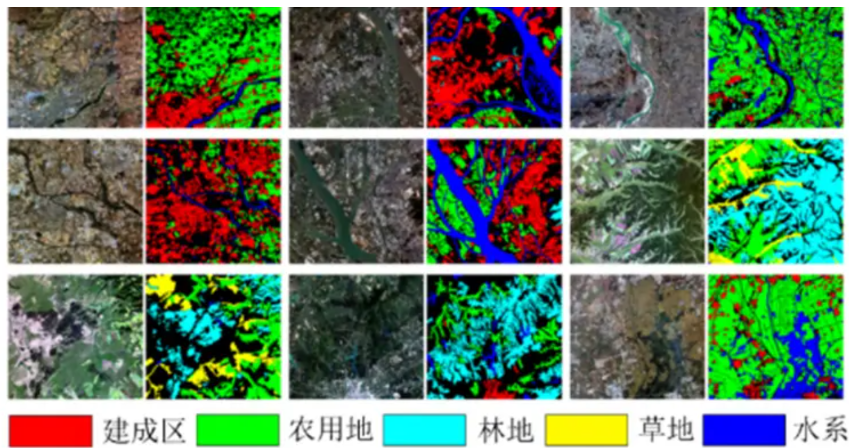

# LOVEwd
## 数据集大小
The LoveDA
 contains 5987 HSR images with 166768 annotated objects from Nanjing, Changzhou and Wuhan cities. 
 
 There are 2713 images for urban scenes and 3274 images for rural scenes.


## 灰度图的像素点
```
no-data regions - 0
background – 1, 
building – 2,
road – 3,
water – 4,
barren – 5,
forest – 6,
agriculture – 7
```
## 分类的颜色对应 （自动-1）
1. (0, 0, 0)：黑色
2. (128, 0, 0)：深红色
3. (0, 128, 0)：深绿色
4. (128, 128, 0)：深黄色
5. (0, 0, 128)：深蓝色
6. (128, 0, 128)：深品红色
7. (0, 128, 128)：深青色
8. (128, 128, 128)：灰色
9. (64, 0, 0)：暗红色
10. (192, 0, 0)：鲜红色
11. (64, 128, 0)：暗绿色
12. (192, 128, 0)：亮黄色
13. (64, 0, 128)：暗蓝色
14. (192, 0, 128)：亮品红色
15. (64, 128, 128)：暗青色
16. (192, 128, 128)：亮灰色
17. (0, 64, 0)：暗绿色（较深）
18. (128, 64, 0)：棕色
19. (0, 192, 0)：鲜绿色
20. (128, 192, 0)：亮黄绿色
21. (0, 64, 128)：暗蓝绿色
22. (128, 64, 12)：土红色


