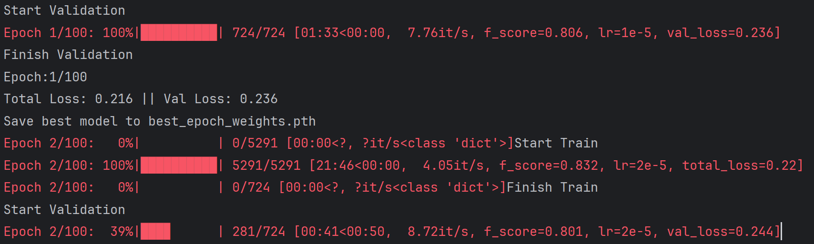

# 1st

## 数据集大小（仅含train/rural的1366照片）


## 像素点的值与数量。

| Key | Value      |
| --- | ---------- |
| 0   | 163415419  |
| 1   | 110326677  |
| 2   | 209899042  |
| 3   | 157610916  |
| 4   | 429103412  |
| 5   | 814890623  |
| 6   | 1316258879 |
| 7   | 12436766   |
| 8   | 13086670   |

## 参数
Configurations:
| keys                | values                      |
| ------------------- | --------------------------- |
| num_classes         | 8                           |
| backbone            | vgg                         |
| model_path          | model_data/unet_vgg_voc.pth |
| input_shape         | [512, 512]                  |
| Init_Epoch          | 0                           |
| Freeze_Epoch        | 50                          |
| UnFreeze_Epoch      | 100                         |
| Freeze_batch_size   | 2                           |
| Unfreeze_batch_size | 2                           |
| Freeze_Train        | True                        |
| Init_lr             | 0.0001                      |
| Min_lr              | 1.0000000000000002e-06      |
| optimizer_type      | adam                        |
| momentum            | 0.9                         |
| lr_decay_type       | cos                         |
| save_period         | 5                           |
| save_dir            | logs                        |
| num_workers         | 2                           |
| num_train           | 3771                        |
| num_val             | 420                         |

## 25/1/13/16：01运行前的权值文件    

ep100-loss0.532-val_loss1.074.pth

## 效果图


## 控制台
### epoch 1 成功

### start validation


### finished


## 分析
```dotnetcli
这些数值表明模型的性能处于中等偏上的水平，以下是具体分析：
mIoU（70.5%）
优点：达到70.5%的mIoU已经是一个相对不错的成绩，尤其是在一些复杂场景的图像分割任务中。这说明模型在对各个类别的分割上，能够较好地平衡准确性和完整性，能够较为准确地识别出各个类别的边界，并且将属于该类别的像素大部分都正确分割出来。
不足：距离一些顶尖模型在某些特定任务上能达到的80%甚至90%以上的mIoU还有一定差距，这可能意味着模型在处理一些细节部分或者类别之间边界较为模糊的区域时，还存在一定的误差，还有进一步提升的空间。
mPA（81.51%）和Accuracy（81.55%）
优点：这两个指标都超过了80%，表明模型在像素级别的分类上具有较高的准确性。大部分像素都能被正确地分类到对应的类别中，这在实际应用中能够为后续的任务（如目标识别、场景理解等）提供较为可靠的输入。
不足：与mIoU类似，虽然已经很不错，但距离极致的性能还有提升空间。在一些对精度要求极高的应用场景下，如医学图像分割中对病变区域的精确识别，可能还需要进一步优化模型以提高这些指标。
Total Loss（0.532）和Val Loss（1.074）
优点：Total Loss较低，说明模型在训练数据上拟合得较好，能够较好地学习到训练数据中的特征和规律。这为模型在新数据上表现良好打下了基础。
不足：
Val Loss相对Total Loss较高，这可能意味着模型存在一定程度的过拟合。即模型在训练数据上表现很好，但在未见过的验证数据上，由于对训练数据的一些细节特征过度学习，导致在新数据上泛化能力稍差，不能很好地适应数据的变化。
Val Loss的绝对值1.074也表明模型在验证数据上的预测与真实值之间还存在较大的差异，需要进一步调整模型结构或训练策略，以降低验证损失，提高模型的泛化能力。
```
