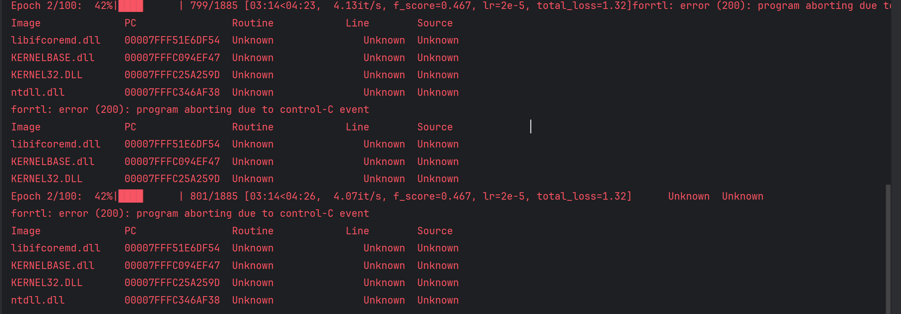
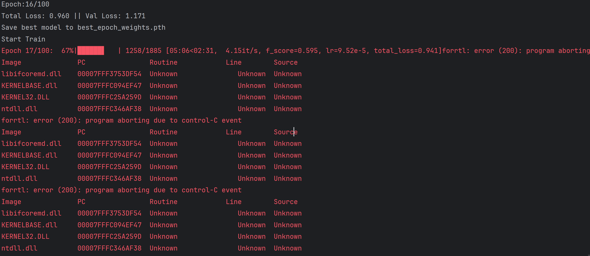
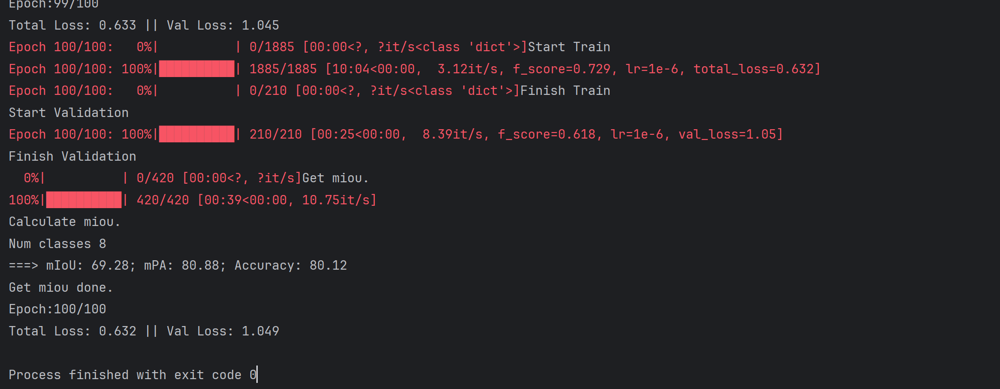

## 数据集
train and val size 4191
traub suze 3771

## 分类
| Key | Value      |
| --- | ---------- |
| 0   | 145409132  |
| 1   | 1525959012 |
| 2   | 404299316  |
| 3   | 213710339  |
| 4   | 362297559  |
| 5   | 207131990  |
| 6   | 534690631  |
| 7   | 1001084037 |

##

## 训练终止
    #   如果训练过程中存在中断训练的操作，可以将model_path设置成logs文件夹下的权值文件，将已经训练了一部分的权值再次载入。
    #   同时修改下方的 冻结阶段 或者 解冻阶段 的参数，来保证模型epoch的连续性。

### 终止于
Epoch 16/100: 100%|██████████| 210/210 [00:27<00:00,  7.62it/s, f_score=0.567, lr=9.59e-5, val_loss=1.17]
Finish Validation
Epoch:16/100
Total Loss: 0.960 || Val Loss: 1.171 
Save best model to best_epoch_weights.pth
Start Train
Epoch 17/100:  67%|██████▋   | 1258/1885 [05:06<02:31,  4.15it/s, f_score=0.595, lr=9.52e-5, total_loss=0.941]forrtl: error (200): program aborting due to control-C event
Image              PC                Routine            Line        Source             
libifcoremd.dll    00007FFF3753DF54  Unknown               Unknown  Unknown
KERNELBASE.dll     00007FFFC094EF47  Unknown               Unknown  Unknown
KERNEL32.DLL       00007FFFC25A259D  Unknown               Unknown  Unknown
ntdll.dll          00007FFFC346AF38  Unknown               Unknown  Unknown
forrtl: error (200): program aborting due to control-C event
Image              PC                Routine            Line        Source             
libifcoremd.dll    00007FFF3753DF54  Unknown               Unknown  Unknown
KERNELBASE.dll     00007FFFC094EF47  Unknown               Unknown  Unknown
KERNEL32.DLL       00007FFFC25A259D  Unknown               Unknown  Unknown
ntdll.dll          00007FFFC346AF38  Unknown               Unknown  Unknown
forrtl: error (200): program aborting due to control-C event
Image              PC                Routine            Line        Source             
libifcoremd.dll    00007FFF3753DF54  Unknown               Unknown  Unknown
KERNELBASE.dll     00007FFFC094EF47  Unknown               Unknown  Unknown
KERNEL32.DLL       00007FFFC25A259D  Unknown               Unknown  Unknown
ntdll.dll          00007FFFC346AF38  Unknown               Unknown  Unknown

Process finished with exit code 0

