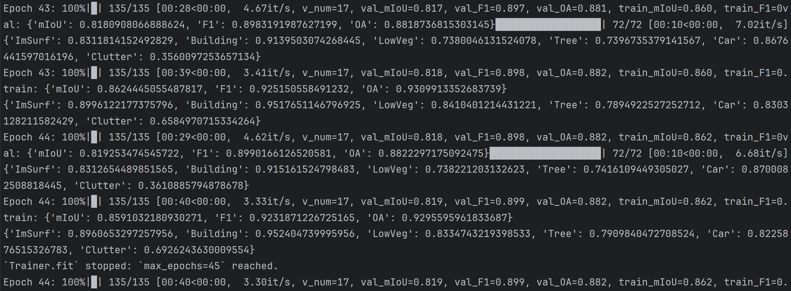

# Potsdam结果
```dotnetcli
F1_ImSurf:0.9059105498957876, IOU_ImSurf:0.8280040994906761
F1_Building:0.9518590943767421, IOU_Building:0.9081403934051561
F1_LowVeg:0.8471111357004676, IOU_LowVeg:0.7347725890432222
F1_Tree:0.861780154417843, IOU_Tree:0.7571297915448615
F1_Car:0.9476298407835975, IOU_Car:0.9004719798299914
F1_Clutter:0.5169293241938869, IOU_Clutter:0.3485533984500863
F1:0.9028581550348875, mIOU:0.8257037706627814, OA:0.8819895212737909
images writing spends: 4.348062038421631 s
```


# pip install causal-conv1d>=1.4.0
 
下载nvcc即可


# ok了


# 重复了

root超级
home普通用户

# 精度
```
(airs) jessiepan@JessiePan:~$ pwd
/home/jessiepan
(airs) jessiepan@JessiePan:~$ cd /home/jessiepan/pycharm_project/airs
(airs) jessiepan@JessiePan:~/pycharm_project/airs$ python GeoSeg/train_supervision.py -c GeoSeg/config/potsdam/unetformer.py
/home/jessiepan/anaconda3/envs/airs/lib/python3.8/site-packages/albumentations/__init__.py:13: UserWarning: A new version of Albumentations is available: 2.0.4 (you have 1.4.18). Upgrade using: pip install -U albumentations. To disable automatic update checks, set the environment variable NO_ALBUMENTATIONS_UPDATE to 1.
  check_for_updates()
/home/jessiepan/anaconda3/envs/airs/lib/python3.8/site-packages/timm/models/_factory.py:117: UserWarning: Mapping deprecated model name swsl_resnet18 to current resnet18.fb_swsl_ig1b_ft_in1k.
  model = create_fn(
/home/jessiepan/anaconda3/envs/airs/lib/python3.8/site-packages/torch/functional.py:513: UserWarning: torch.meshgrid: in an upcoming release, it will be required to pass the indexing argument. (Triggered internally at ../aten/src/ATen/native/TensorShape.cpp:3609.)
  return _VF.meshgrid(tensors, **kwargs)  # type: ignore[attr-defined]
GPU available: True (cuda), used: True
TPU available: False, using: 0 TPU cores
HPU available: False, using: 0 HPUs
You are using a CUDA device ('NVIDIA GeForce RTX 4060 Laptop GPU') that has Tensor Cores. To properly utilize them, you should set `torch.set_float32_matmul_precision('medium' | 'high')` which will trade-off precision for performance. For more details, read https://pytorch.org/docs/stable/generated/torch.set_float32_matmul_precision.html#torch.set_float32_matmul_precision
LOCAL_RANK: 0 - CUDA_VISIBLE_DEVICES: [0]

  | Name | Type           | Params | Mode
------------------------------------------------
0 | net  | UNetFormer     | 11.7 M | train
1 | loss | UnetFormerLoss | 0      | train
------------------------------------------------
11.7 M    Trainable params
0         Non-trainable params
11.7 M    Total params
46.900    Total estimated model params size (MB)
Sanity Checking DataLoader 0: 100%|█████████████████████████████████████████████████████████████████████| 2/2 [00:03<00:00,  0.62it/s]val: {'mIoU': 0.04057721350982653, 'F1': 0.07324241471393836, 'OA': 0.12189158822595161}
{'ImSurf': 1.6724105318034815e-05, 'Building': 0.13961625630458113, 'LowVeg': 3.685175790040866e-05, 'Tree': 0.05173824046824392, 'Car': 0.011477994913089153, 'Clutter': 0.10777775534421694}
```
## 将pin_memory设置为false，取消锁定内存：！！！


## 添加了CRF后处理模块



### test结果
```
100%|███████████████████████████████████████████████████████████████████████████████████████████████| 144/144 [00:26<00:00,  5.45it/s]F1_ImSurf:0.9059104954706976, IOU_ImSurf:0.828004008557268
F1_Building:0.9518589137358405, IOU_Building:0.9081400645484731
F1_LowVeg:0.8471109448225038, IOU_LowVeg:0.734772301825768
F1_Tree:0.8617801789889545, IOU_Tree:0.7571298294765786
F1_Car:0.9476304295133204, IOU_Car:0.9004730430157522
F1_Clutter:0.5169331539716112, IOU_Clutter:0.3485568808688183
F1:0.9028581925062633, mIOU:0.8257038494847679, OA:0.8819895100577042
images writing spends: 12.57465147972107 s
```