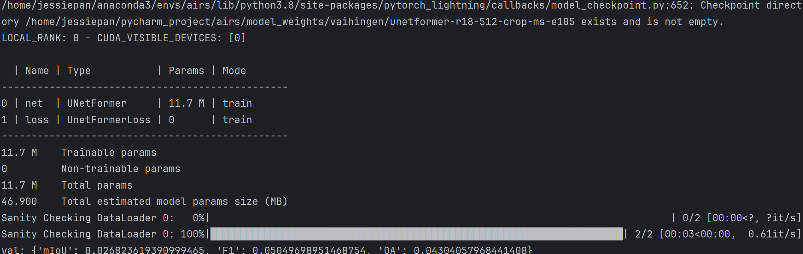
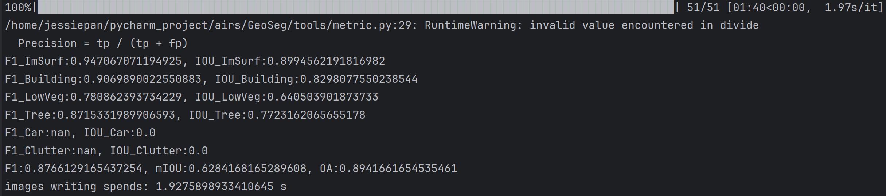

```
al: {'mIoU': 0.8254718994273784, 'F1': 0.9017851984811275, 'OA': 0.9295494269608777}██████████████████| 13/13 [00:03<00:00,  3.32it/s]
{'ImSurf': 0.9386089910279027, 'Building': 0.9126405652477104, 'LowVeg': 0.7016373592724368, 'Tree': 0.8079508054624538, 'Car': 0.766521776126388, 'Clutter': 0.46130742245917955}
Epoch 103: 100%|█| 87/87 [00:20<00:00,  4.21it/s, v_num=3, val_mIoU=0.825, val_F1=0.902, val_OA=0.930, train_mIoU=0.839, train_F1=0.91train: {'mIoU': 0.8413023757545244, 'F1': 0.9122953671587878, 'OA': 0.9311089844539248}
{'ImSurf': 0.9154738719705064, 'Building': 0.9274109126349881, 'LowVeg': 0.784032739037837, 'Tree': 0.8233968436977637, 'Car': 0.7561975114315265, 'Clutter': 0.9176575963808492}
Epoch 104: 100%|█| 87/87 [00:17<00:00,  4.98it/s, v_num=3, val_mIoU=0.825, val_F1=0.902, val_OA=0.930, train_mIoU=0.841, train_F1=0.9val: {'mIoU': 0.8244948192130458, 'F1': 0.9011637158892786, 'OA': 0.9289120064603417}██████████████████| 13/13 [00:03<00:00,  3.34it/s]
{'ImSurf': 0.938271156218756, 'Building': 0.9126952369799405, 'LowVeg': 0.7001090450542089, 'Tree': 0.8054932957864058, 'Car': 0.7659053620259184, 'Clutter': 0.4525797719859205}
Epoch 104: 100%|█| 87/87 [00:22<00:00,  3.95it/s, v_num=3, val_mIoU=0.824, val_F1=0.901, val_OA=0.929, train_mIoU=0.841, train_F1=0.91train: {'mIoU': 0.83970293967941, 'F1': 0.9112612162565552, 'OA': 0.9306601655894312}
{'ImSurf': 0.9130100503193137, 'Building': 0.9276381805779359, 'LowVeg': 0.7820443905803123, 'Tree': 0.8280420235273959, 'Car': 0.7477800533920917, 'Clutter': 0.9081118059197921}
`Trainer.fit` stopped: `max_epochs=105` reached.
Epoch 104: 100%|█| 87/87 [00:22<00:00,  3.91it/s, v_num=3, val_mIoU=0.824, val_F1=0.901, val_OA=0.929, train_mIoU=0.841, train_F1=0.91
```


# test
